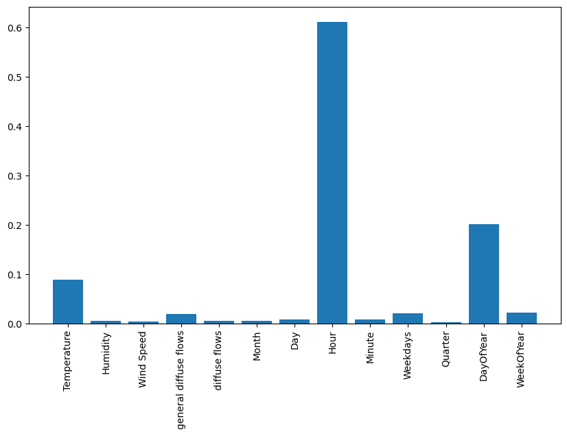
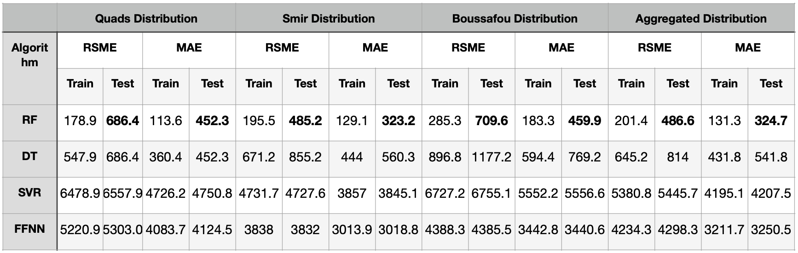
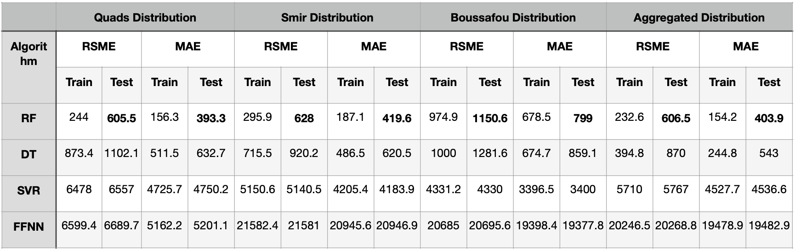
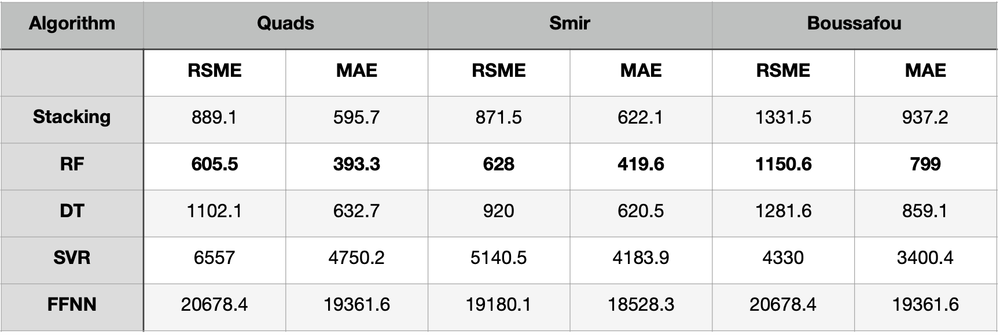

# Predicting electricity consumption in Tetouan city using statistical ML and Deep leaning
*Reproduced the result from research paper "[Comparison of Machine Learning Algorithms for the Power Consumption Prediction: Case Study of Tetouan City](https://ieeexplore.ieee.org/document/8703007)". Use public dataset at [UCI Machine Learning Repository](https://archive.ics.uci.edu/dataset/849/power+consumption+of+tetouan+city).*

In addition, I build ensemble models to check whether its improve performance.

## Language:
Python: sklearn, keras

## Overview:
Predicting electricity consumption is a crucial activity that provides valuable insights to utility companies, enhancing their efficiency and effectiveness. Machine learning models are recognized as the most accurate tools for such predictions. 

The dataset was combined from 3 distinct power distribution networks in Tetouan city, located in northern Morocco sourced from the Supervisory Control and Data Acquisition (SCADA) system,
covers the period from January 1, 2017, to December 31, 2017. It is a unique dataset, and it does not have any missing data. It is consisted of the date, time and the consumption of the three distribution networks.

## Used ML methods:
The models aims to forecast electricity consumption at intervals of every 10 minutes and/or every hour. 5 models was build which are: 
- Feedforward neural network with a back-propagation algorithm,
- Random forest,
- Decision tree,
- Support Vector Machine forregression (SVR) with a radial basis function kernel,
- Stacked Generalization

## Data preprocess
- Extracting attribute from 'Datetime' columns to month, day of the month, hour, day of the year, week of the year, day of the week, quarter, and minute. These are independent variables that are analyzed for their correlation with the dependent variable (power consumtion)
- Check feature importance based on mean decrease in impurity by using random forest. As illustrated in plot, although all variables contribute to the model, **the hour** and temperature are the most significant.

- Each algorithm is developed using a training split of 75% of the data, with the remaining 25% allocated for
testing.
- Normalized the X to [0,1], making it suitable for some ML models like SVR and neural networks.
- Used GridSearch to find optimal hyperparameter.

## Evaluation
The test set is typically employed to evaluate models. Here training set also be utilized to show the ability of learning. For comparative analysis, the median across nine implementations in all dataset models was used also. 

**4 initial models**
RSME AND MAE COMPARISON OF ALGORITHMS IN 3 DISTRIBUTIONS FOR 10 MINUTES POWER CONSUMPTION

RSME AND MAE COMPARISON OF ALGORITHMS IN 3 DISTRIBUTION NETWORKS FOR THE ONE HOURLY POWER CONSUMPTION

The 2 tables findings indicate that the random forest model generally outperforms others, achieving lower
prediction errors

**Adding stacking model**
RSME AND MAE COMPARISON OF ALGORITHMS (WITH STACKING) IN 3 DISTRIBUTIONS FOR 10 MINUTES POWER CONSUMPTION

RSME AND MAE COMPARISON OF ALGORITHMS (WITH STACKING) IN 3 DISTRIBUTIONS FOR THE ONE HOURLY POWER CONSUMPTION

As we can see, RF is still a best model, however stacking is also close with RF. Even though stacking expect to be outperform the base model due to the generalization from multiple prediction, but there is no certainty that ensemble model will be outperform the base one.

I think the reason for this might due to overfitting, because stacking involves layering models on top of one another, the current based models if they complex  might lead to overfit and make the performance worse than base model.

